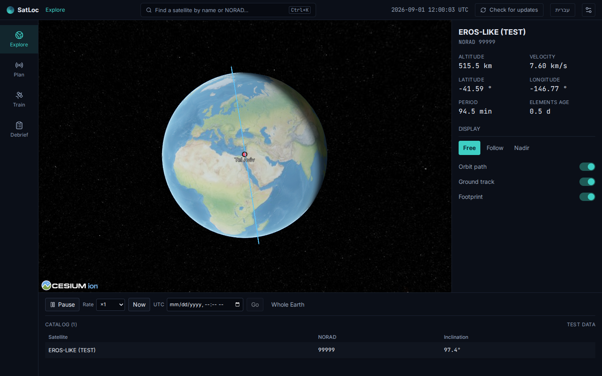
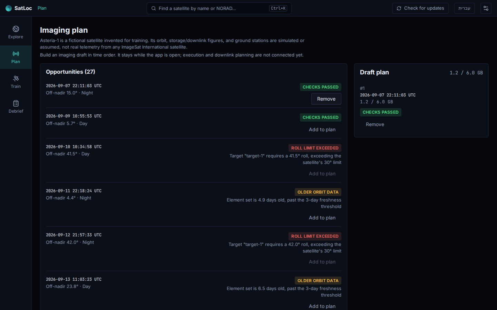
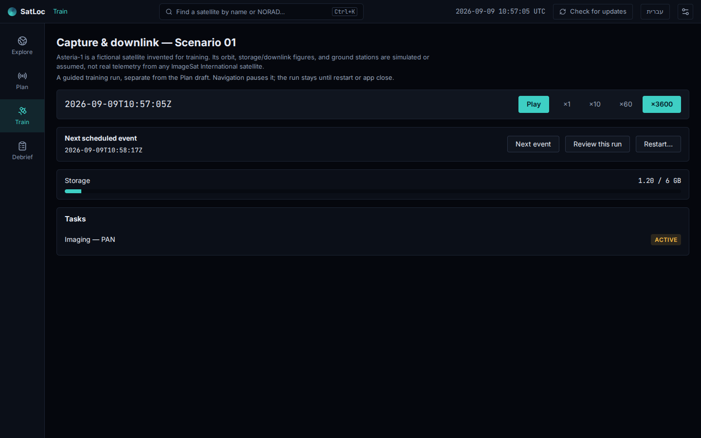
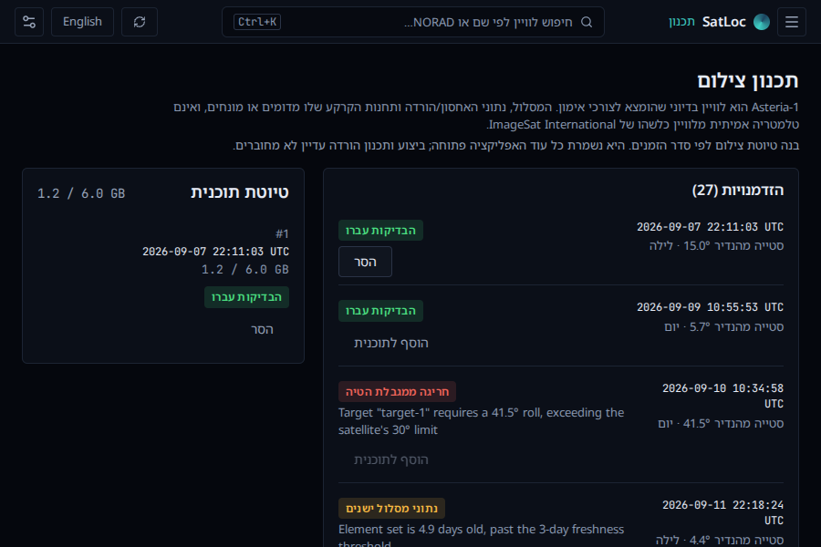

# SatLoc — נקודת חזרה לעבודה

סבב הייצוב מבוסס על גרסה 0.5.1 ועל commit `f7b09e5`. השינויים בענף זה עדיין אינם גרסה מופצת.
המטרה היא סביבת עבודה מקומית למפעיל לוויין: צילום, תקשורת ואימון, ובהמשך NOC.

## מה הפריע לעבודה ומה תוקן

| בעיה שנמצאה                                         | ההתנהגות בענף הזה                                                    |
| --------------------------------------------------- | -------------------------------------------------------------------- |
| טיוטת צילום נמחקה במעבר מסך                         | הבחירות נשמרות במהלך פתיחת האפליקציה ומסודרות לפי זמן                |
| כניסה חוזרת לאימון התחילה ריצה חדשה                 | אותה ריצה נשמרת; מעבר מסך משהה אותה                                  |
| התחקיר יצר ריצת דוגמה חדשה ומלאה                    | הוא מציג את האירועים שבוצעו בהרצה הנוכחית, גם אם היא חלקית           |
| כותרת האימון הציגה זמן שאינו זמן האימון             | הכותרת והאימון מציגים את אותו שעון                                   |
| לא הייתה דרך נוחה להגיע לאירוע הראשון               | כפתור האירוע הבא מתקדם לזמן האירוע האמיתי; ההרצה נעצרת בסיום         |
| בקרות זמן ומצלמה נעלמו בהחלפת המעטפת                | חזרו השהיה, מהירות, עכשיו, קפיצה ל־UTC, מבט כללי, מעקב ונדיר         |
| חזרה לגלובוס איפסה זמן ומצלמה                       | המצב משוחזר, בלי להשאיר מנוע תלת־ממד פועל ברקע                       |
| בחירה חוזרת באותו לוויין לא פתחה את הפרטים בחלון צר | בחירה בקטלוג פותחת את הפרטים בכל פעם; גם באמצעות מקלדת               |
| תכנון ואימון ירשו פאנלים ריקים מהגלובוס             | הם משתמשים בכל שטח העבודה; הטיוטה מוצגת לצד ההזדמנויות               |
| חישוב של 30 ימים חסם את תהליכון הממשק               | החישוב משתמש ב־ForecastClient הקיים ברקע, עם חיווי טעינה וטיפול בכשל |
| החיפוש הבטיח גם משימות ופקודות                      | הוא מתאר את הפעולה הקיימת: חיפוש לוויין; בחירה מחזירה לתצפית         |

## ניסיון קצר ב־Windows

1. בתצפית, בחר לוויין, שנה מהירות והשהה. עבור לתכנון וחזור; הזמן והמצלמה צריכים להישמר.
2. בתכנון, הוסף שתי הזדמנויות ללא חסימה. עבור לאימון וחזור; הטיוטה ונפח האחסון צריכים להישמר.
3. באימון, לחץ האירוע הבא פעמיים. אמור להופיע צילום פעיל ואחסון של 1.2 GB.
4. פתח תחקור ההרצה. צריכים להופיע רק שני האירועים שכבר קרו. חזור לאימון והמשך.
5. המשך עד סוף ההרצה: שתי המשימות הושלמו, האחסון חזר לאפס, והתחקיר מציג שמונה אירועים.
6. נסה עברית וחלון 900×600. התכנון צריך להישאר קריא וטיוטתו נגישה, ללא גלילה אופקית.

הריצה והטיוטה נשמרות **במעבר מסך**, לא בסגירת האפליקציה או בטעינה מחדש.
התחלה מחדש של אימון דורשת לחיצה נוספת כדי להחליף את ההרצה הקיימת.

## גבולות המצב הנוכחי

- תכנון מציג טיוטת צילום. אין עדיין חיבור מהטיוטה לביצוע, בחירת חלונות הורדה בממשק או אישור אזהרות.
- האימון מריץ את תרחיש 01 של Asteria-1, לוויין בדיוני. אלה אינם נתוני תפעול אמיתיים של ISI.
- חיווי הצלחת בדיקות מתייחס לכללים שכבר קיימים. הוא אינו אישור תוכנית מבצעית: למשל, בחירה בלילה עדיין מופיעה ברשימה, ואין בדיקה מלאה של תאורה, סיבוב, חום והתנגשויות משימות.
- תגי המצב תורגמו; הסברים מפורטים שמגיעים מכללי הליבה עדיין באנגלית.
- בדיקות אוטומטיות משתמשות בנתוני בדיקה ובאריחים מקומיים. משיכת נתונים חיים, WebView2, התקנה ועדכון דורשים גם בדיקה באפליקציית Windows.

## היעד הבא: תכנון → ביצוע → תחקיר

לפני הרחבת NOC או Android, להשלים תרחיש אחד שנבנה בידי המפעיל:

1. בחירת צילום ביום ותחנת קרקע עם חלון הורדה מתאים.
2. בדיקת תאורה, סדר זמנים, אחסון וקיבולת הורדה; חסימה ברורה של תוכנית לא אפשרית.
3. אישור מפורש ומתועד לאזהרה שניתן לוותר עליה.
4. העברת **אותה תוכנית** לאימון, הרצה והצגת תוצאה מול התוכנית.
5. שמירה וטעינה של ההרצה דרך מודל הסשן הקיים ותחקור האירועים שלה.

תנאי סיום: אפשר להשלים את המסלול הזה מהממשק בלבד, לשמור ולפתוח שוב, בעברית ובאנגלית,
וגם על Windows המותקן. עד אז אין להציג את הפרויקט כסימולטור תפעולי מלא.

## אימות וצילומי מסך

בדיקות היחידה, הבנייה ובדיקות הדפדפן מכסות את השינויים; פרטי התוצאות והגבלות הסביבה מופיעים ב־PR.
התמונות להלן צולמו מהממשק הרץ עם נתוני בדיקה, ולא מהדמיית עיצוב.

