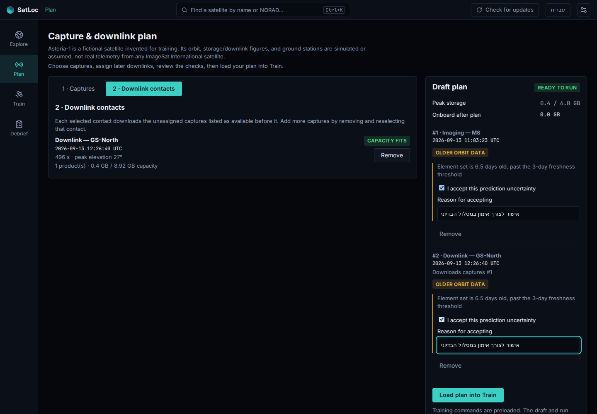
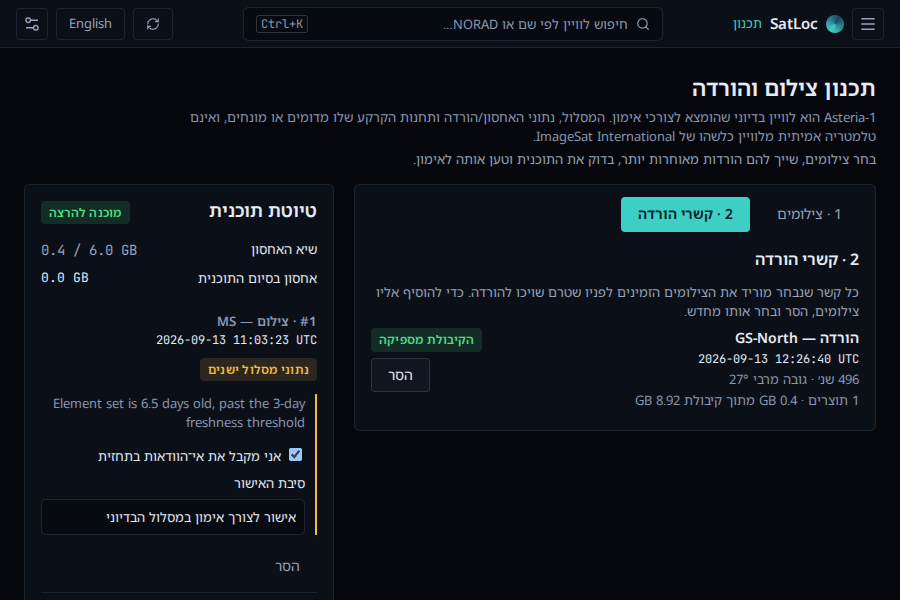
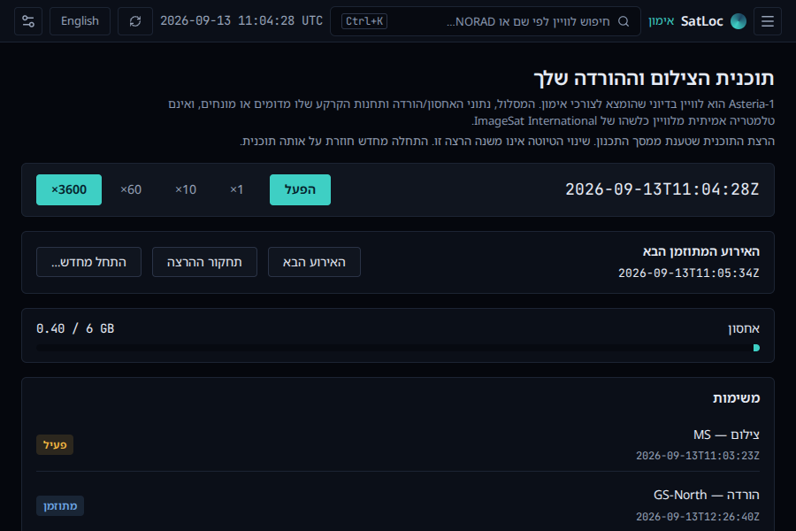
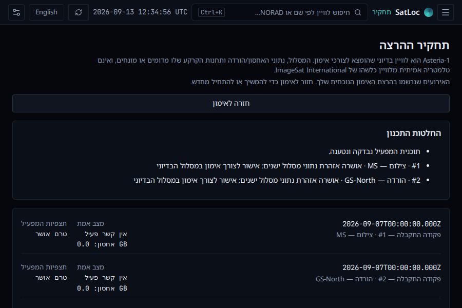

# SatLoc — נקודת חזרה לעבודה

נקודת המוצא היא גרסה 0.5.1, סבב הייצוב ב־PR #54 וענף `main`.
הסבב הנוכחי מחבר תוכנית שבנה המפעיל להרצה ולתחקיר. הוא עדיין אינו גרסה מופצת.
המטרה היא סביבת עבודה מקומית למפעיל לוויין: צילום, תקשורת ואימון, ובהמשך NOC.

## מה הפריע לעבודה ומה תוקן

| בעיה שנמצאה                                         | ההתנהגות בענף הזה                                                    |
| --------------------------------------------------- | -------------------------------------------------------------------- |
| טיוטת צילום נמחקה במעבר מסך                         | הבחירות נשמרות במהלך פתיחת האפליקציה ומסודרות לפי זמן                |
| כניסה חוזרת לאימון התחילה ריצה חדשה                 | אותה ריצה נשמרת; מעבר מסך משהה אותה                                  |
| התחקיר יצר ריצת דוגמה חדשה ומלאה                    | הוא מציג את האירועים שבוצעו בהרצה הנוכחית, גם אם היא חלקית           |
| כותרת האימון הציגה זמן שאינו זמן האימון             | הכותרת והאימון מציגים את אותו שעון                                   |
| לא הייתה דרך נוחה להגיע לאירוע הראשון               | כפתור האירוע הבא מתקדם לזמן האירוע האמיתי; ההרצה נעצרת בסיום         |
| בקרות זמן ומצלמה נעלמו בהחלפת המעטפת                | חזרו השהיה, מהירות, עכשיו, קפיצה ל־UTC, מבט כללי, מעקב ונדיר         |
| חזרה לגלובוס איפסה זמן ומצלמה                       | המצב משוחזר, בלי להשאיר מנוע תלת־ממד פועל ברקע                       |
| בחירה חוזרת באותו לוויין לא פתחה את הפרטים בחלון צר | בחירה בקטלוג פותחת את הפרטים בכל פעם; גם באמצעות מקלדת               |
| תכנון ואימון ירשו פאנלים ריקים מהגלובוס             | הם משתמשים בכל שטח העבודה; הטיוטה מוצגת לצד ההזדמנויות               |
| חישוב של 30 ימים חסם את תהליכון הממשק               | החישוב משתמש ב־ForecastClient הקיים ברקע, עם חיווי טעינה וטיפול בכשל |
| החיפוש הבטיח גם משימות ופקודות                      | הוא מתאר את הפעולה הקיימת: חיפוש לוויין; בחירה מחזירה לתצפית         |

## מה נוסף: תוכנית שאתה בונה ומריץ

בתכנון אפשר לבחור צילום PAN או MS ולשייך אליו קשר הורדה אמיתי מהתחזית של GS-Home או GS-North.
הטיוטה מציגה את סדר המשימות, שיא האחסון והנפח שיישאר בסיום. תאורה לא מספקת, חלונות חופפים,
תוצר ללא הורדה, חריגת אחסון או קשר קצר מדי חוסמים טעינה. אזהרת נתוני מסלול ישנים דורשת סימון
אישור ונימוק לכל משימה; שינוי בחירת המשימות מאפס את האישורים.

טעינת התוכנית יוצרת הרצה מושהית של הבחירות שלך. אם כבר קיימת הרצה, נדרש אישור נוסף להחלפתה.
שינוי הטיוטה לאחר מכן אינו משנה את ההרצה. התחלה מחדש מריצה שוב את אותה תוכנית, והתחקיר מציג
את האירועים שלה ואת נימוקי האזהרות שאושרו. כניסה לאימון בלי לטעון תוכנית עדיין פותחת את התרחיש המודרך.

## ניסיון קצר ב־Windows

1. פתח **תכנון**, המתן לסיום החישוב ובחר מצב צילום MS. הוסף הזדמנות שניתנת לבחירה.
2. לחץ **בחר קשר הורדה**, בחר GS-North עם קיבולת מספקת ולחץ **הוסף הורדה**.
   בטיוטה צריכים להופיע צילום, הורדה, שיא אחסון 0.4 GB ואפס בסיום.
3. אם מופיעות אזהרות, סמן אישור וכתוב נימוק בכל אחת. סימון בלי נימוק אינו מאפשר טעינה.
4. לחץ **טען תוכנית לאימון**. אם קיימת הרצה, נסה קודם ביטול וחזרה לאימון כדי לראות שהיא נשמרה;
   חזור לתכנון ואשר את ההחלפה. אמורות להופיע שתי המשימות שבחרת, כשההרצה מושהית.
5. לחץ **האירוע הבא** עד ההשלמה. האחסון עולה ל־0.4 GB בצילום וחוזר לאפס בהורדה;
   שתי המשימות מגיעות למצב בוצע.
6. פתח את תחקיר ההרצה. ודא שהצילום הוא MS, התחנה GS-North והזמנים הם אלה שנבחרו;
   נימוקי האזהרות צריכים להופיע ברשימת החלטות התכנון.
7. חזור לתכנון, הסר ובחר מחדש קשר. האישורים צריכים להתאפס, וההרצה שכבר בוצעה להישאר ללא שינוי.
8. נסה עברית וחלון 900×600. הטיוטה צריכה להיות נגישה בגלילה, בלי גלילה אופקית.

הריצה והטיוטה נשמרות **במעבר מסך**, לא בסגירת האפליקציה או בטעינה מחדש.

## גבולות המצב הנוכחי

- Asteria-1 הוא לוויין אימון בדיוני עם יעד צילום אחד ושתי תחנות; אלה אינם נתוני תפעול אמיתיים של ISI.
- תחזית התכנון היא ל־30 ימים מתחילת התרחיש הקבוע. לא מדובר בתכנון מול לוויין חי שנבחר בגלובוס.
- פקודות נטענות מראש לתרחיש האימון. אין כאן תכנון שידור פקודות אל הלוויין בקשר RF.
- אין עדיין סימולציית תקלות, הספק, חום או תנועת גוף בין משימות. כמדיניות שמרנית, כל חלון צילום
  וכל חלון קשר שוריינים במלואם; חפיפה ביניהם נחסמת גם אם העברת הנתונים הייתה מסתיימת קודם.
- התגים והבקרות בעברית ובאנגלית; ההסבר המפורט של גיל נתוני המסלול עדיין מגיע מהליבה באנגלית.
- בדיקות אוטומטיות משתמשות בנתוני בדיקה ובאריחים מקומיים. משיכת נתונים חיים, WebView2, התקנה
  ועדכון דורשים גם בדיקה באפליקציית Windows. בניית מתקין תקינה אינה מחליפה את הניסיון הזה.

## היעד הבא: שמירה וחזרה לאותה עבודה

המסלול תכנון → ביצוע → תחקיר זמין כעת במהלך פתיחת האפליקציה. לפני NOC או Android:

1. לבצע את בדיקת הקבלה במתקין Windows של הענף הזה.
2. להוסיף שמירה וטעינה של הטיוטה, התוכנית שאושרה והרצה חלקית. מודל הסשן הקיים שומר אירועים,
   אך חידוש הרצה דורש גם את התוכנית ולוח האירועים שטרם קרו.
3. לוודא שסגירה ופתיחה מחדש מחזירות את אותה עבודה ואת אותו תחקיר, בעברית ובאנגלית.

## אימות וצילומי מסך

בדיקות הליבה מכסות חסימות, אישור אזהרות, העברה מדויקת בזמן, גבולות האחסון והרצה מתוכנית אמיתית
מהתחזית. בדיקת הדפדפן בונה תוכנית MS/GS-North, בודקת ביטול החלפה ואיפוס אישורים, מריצה אותה
ומשווה את התחקיר לזמן הצילום שנבחר. בדיקת גאומטריה המשתמשת באותו מנוע היא בדיקת אינטגרציה,
ולא מקור עצמאי להוכחת דיוק מסלולי. פרטי תוצאות הבדיקות מופיעים ב־PR.

התמונות צולמו מהממשק הרץ עם נתוני בדיקה:

